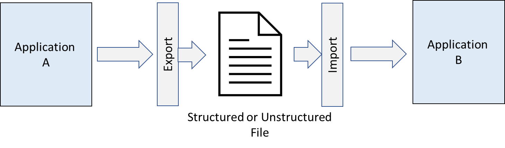
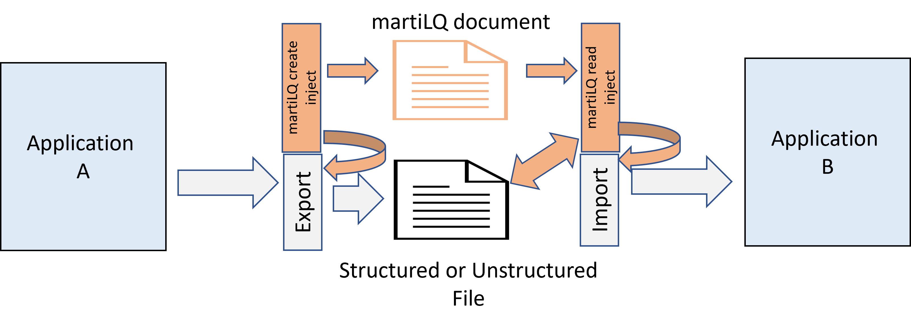
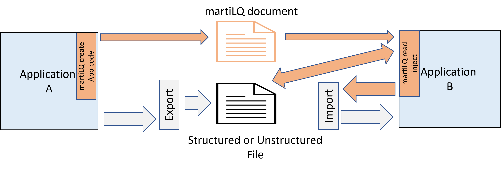
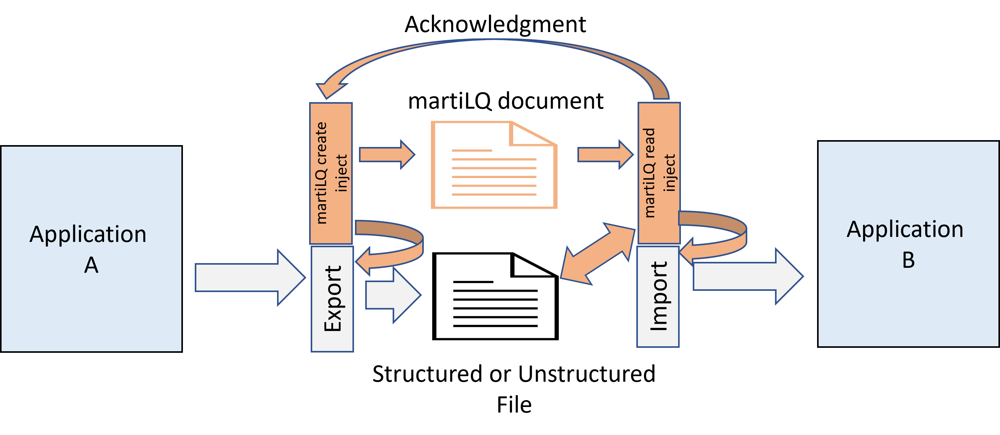

# Design pattern

## Abstract

**MartiLQ** defines a software pattern (document) for describing data files or documents generated from a source
and intended to be consumed by another system component with self-describing information with 
load assurance metrics.

The consuming system component can be at the same location, a different geographical location,
the same organization or another organization.

The pattern does not define the format that the data file or document must take or how the data is transferred
or accessed.  You choose the data format and transfer method. Once you have made the choice, you can describe
it in the **martiLQ** document.   

Describing the format and transfer can be tooled so that the mundane activity is automated and only
the specific nuance or additional assurance aspects need your attention.  Sample scripts are provided
to demonstrate generating the **martiLQ** document. 

## Name

**martiLQ** documentation standard

## Problem statement

Even though event streaming is a strategic goal for many organizations, there exists legacy processes and there
will continue to be a need to transfer data flies and other documents from one system to another. 

When a handover of a data file or document occurs, the best practice is to include metrics with the transfer
to assure the recipient of provenance and quality of the data file or document.  This is the metadata associated
with the data file or document.

A document includes unstructured data, letters, pictures, binary objects while data files could be though of
as structured data that is describes multiple records. 

### Assurance Problem

**How does the recipient know they have received all related files, the provenance, it is immutable and 
assurance on quality?**

Many organizations have used the file name as the carrier of this information but this has limits.

## Efficiency Problem

**How can the assurance be described so that it can be tooled and not rely on manual documentation
and custom tooling?** 

With the drive to DevSecOps or DataOps, any pattern that can be self describing or at least majority
self describing will improve documentation and quality of the process.  This boosts the efficiency 
of building, testing and maintaining the transfer of data files and documents. 

Therefore the objective is to produce a documentation standard that:

1. provides load assurance when transferring data files and documents
2. can be tooled and therefore achieve some level of automation 
3. is extensible to give the publisher and consumer control as to the level of assurance 
   required to match the risk appetite of the organization

## Context

This pattern is intended to be applied when assurance is required on transferred data files and documents.
The data files or documents are commonly packaged together and the pattern is not intended for
real time event processing nor single record processing.  The pattern can be used on
single data file or document if each is considered independent and standalone. 

Packaging the related data files and documents is part of data integrity especially if 
referential integrity for foreign keys is required or the documents relate all to
the same case such as in workflow.

The assurance includes the following scope and this can be extended to meet changing conditions or 
changes in threats or risk.

### Assurance scope

The individual items below are not mandatory but are provided as part of the standard definition
as they are considered the minimal for best practice

* Provenance
* Immutable
* Data period or timeline
* Sequence or batch
* Status and expiry date
* Link to data file or document
* Format, encoding, compression
* Data record count

There is an acknowledgment process that is recommended for confirmation on processing.  See 
[acknowledgement](docs/source/acknowledgement.md) for approach details.

## Forces

The qualities that this pattern is addressing are:

1. Frees transfer from file naming convention that include magic strings that store metadata
2. A event message based paradigm which is independent of the size and number of files
3. Publishes basic metadata on the files and their source 
4. Secures the file transfer from tampering or corruption
5. Allows the inclusion of quality metrics such as provenance, elements and record counts
6. Allows the consumer to select the files to process avoiding unnecessary transfers
7. Provides a simple acknowledgment process
8. Is extendable

The file transfer pattern is the original method for separate processes to exchange data.  The file being stored on magnetic tape and either 
loaded back onto the same compute resource (think mainframe) or physically couriered to another location or tape drive.  The
reference book [Enterprise Integration Patterns](https://www.enterpriseintegrationpatterns.com/patterns/messaging/FileTransferIntegration.html) 
by Hohpe and Woolf recognizes this by inclusion of the pattern written by Martin Fowler.

---
**The basic _file transfer_ pattern**

---

In the explanation written by Martin Fowler, he makes observations about the "File Transfer" including:

"Part of what makes _File Transfer_ simple is that no extra tools or integration packages are needed, but that also means that developers 
have to do a lot of the work themselves. The applications must agree om file-naming conventions and the directories they appear.  ...
, then some application must take responsibility for transferring the file form one disk to another"

The pattern being described here addresses the issues and concerns that relate to file transfer. Many of these are related to the common 
non functional requirements that architects cover in solution designs.

## Solution

The **martiLQ** document pattern can be implemented in various combinations.  Some combinations are illustrated below.

---
**Using the pattern without large scale change to existing processing**

---

---
**Inclusion of the pattern into existing application code to generate and read the martiLQ document**

---

---
**If there is a requirement for acknowledgement to the publisher, then maybe this approach is applicable**

---

### Security, robustness, reliability, fault-tolerance

The pattern defines how security and assurance is applied to the data files and documents.  The pattern does 
not define how to setup a reliable infrastructure, but it can be used to detect failures
in the infrastructure.  The fault-tolerance allowance is up to each implementation.

Fault-tolerance and the actionable task can be dialled from 0% tolerance to 100% tolerance on a
case by case basis. 

### Manageability

The pattern takes into consideration of how the file transfer is managed.  It can provide a standard
that makes file transfers easier to manage regardless of the underlying transport mechanism. As the
same **martiLQ** document can be consumed by multiple recipients, it is easy to distribute, with 
access controls ensuring only authorized recipients can access the files that are relevant to them.

This reduces the need to run multiple jobs distributing the files.

Management is also improved if the acknowledgement capability is implemented so that the publisher
knows which recipient has processed the file.  If the recipient no longer wishes the file and stops
processing the publisher will slowly build a time line and metrics to recognize that the file 
is no longer consumed.  The publisher can then cease to produce unused files.

### Efficiency, performance, throughput, bandwidth requirements, space utilization

If the process is using event based messaging, files that are not required at the destination
are never transferred.  This saves bandwidth and storage at the destination.

### Scalability (incremental growth on-demand)

The pattern scalability is not bound to the size of the data files themselves.  The pattern can 
be scaled to include thousands of data files or documents, though the practically of processing
may be factor in the decision of breaking down to smaller volumes.

### Extensibility, evolvability, maintainability

The **martiLQ** document can be customized and can evolve as the market conditions change.  Versioning
is built into the definition and consumers can select which attributes are mandatory for
processing. 

### Modularity, independence, re-usability, openness, composability (plug-and-play), portability

The **martiLQ** document is an open definition that can be used in may file transfer scenarios.  You can compose
new functionality on top of the open code.

The **martiLQ** document is portable as is the reference implementation.  You can run the Python, PowerShell, Go code
on both Windows and Linux platforms and on different architectures.

### Completeness and correctness

The **martiLQ** document contains metadata to ensure that all files in a job file transfer are treated
as a package or integral unit.  If files are missing then this is recognized early in the process and
the recipient consumer can decide on whether to continue processing or halt.

Additional scope also exists in the **martiLQ** document to add more load quality assurance metrics, which can be 
automatically processed to ensure correctness.

### Ease-of-construction

The **martiLQ** document is a JSON formatted document, making it easy to construct using modern tools.

**Note**: An XML format document is in the backlog for possible implementation.

Using the reference implementation, the organization can implement the pattern into their current process without
requiring extensive builds.  The reference implementation has code in various programming languages and can run on
Windows and Linux platforms.

All code is visible and auditable.

**Note**: The reference implementation is not the most efficient code in all situations and there is much room for
improvement.  The objective of the reference implementation was to demonstrate the ease of use by scanning 
file system directory or converting from another format such as CKAN.

### Ease-of-use

If you are comfortable with using the reference implementation, you can be generating **martiLQ** documents in short time.

Download the git repository code, review the samples and adjust to scan your directory to generate the **martiLQ** document.
As a simplistic approach you can execute the code in your pipeline after you have created existing files.

## Resulting Context

After applying the pattern consistently on file transfers within the organization, the expectation is that you will spend less
time discussing and building the mechanics of file transfer including the polling, monitoring and load assurance.  A large portion
which will have been for you as part of the **martiLQ** document and its implementation.

There will also less documentation to review and discuss as the **martiLQ** document will provide standards that developers can 
follow such as the encoding and format.  This applies to both structured and unstructured data.

You will still need to decide fo structured data on how many files, the data columns and records to be included in each file.

For unstructured data, such as bundling like documents together, the process is much simpler if you take the approach to create
a folder containing the files and then execute the routine to compress and package all together.

## Examples

Please refer to the [documentation](docs/source/README.md) and [samples](docs/source/samples/README.md)
